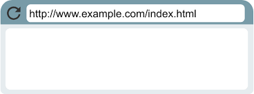
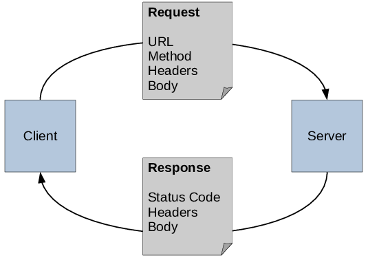

# HTTP & HTTPS Onderzoek (Pagina 1)

## Inhoudsopgave
1. [HTTP & HTTPS: Waar staat de afkorting voor?](#1-http--https-waar-staat-de-afkorting-voor)
2. [Definitie: Uitleg in eigen woorden](#2-definitie-uitleg-in-eigen-woorden)
3. [Hoe draagt HTTP/HTTPS bij aan de functionaliteit van het internet?](#3-hoe-draagt-httphttps-bij-aan-de-functionaliteit-van-het-internet)
4. [Veiligheid: Welke rol speelt HTTPS bij het waarborgen van online communicatie?](#4-veiligheid-welke-rol-speelt-https-bij-het-waarborgen-van-online-communicatie)
5. **[Ga naar pagina 2](pagina2.html)**

---

## 1. HTTP & HTTPS: Waar staat de afkorting voor?
- **HTTP**: HyperText Transfer Protocol  
- **HTTPS**: HyperText Transfer Protocol Secure  

  HTTPS is een beveiligde versie van HTTP die gebruikmaakt van SSL/TLS-versleuteling.

**Vergelijking van HTTP en HTTPS in de browserbalk:**
- HTTP zonder beveiliging  
  
- HTTPS met een slotje  
  

[🔝 Terug naar Inhoudsopgave](#inhoudsopgave)

---

## 2. Definitie: Uitleg in eigen woorden
HTTP en HTTPS zijn protocollen die gegevensuitwisseling tussen een webbrowser en een server mogelijk maken.  
- HTTP wordt gebruikt om informatie (zoals webpagina's) op te vragen en te verzenden.  
- HTTPS biedt dezelfde functionaliteit maar met extra beveiliging door versleuteling.

[🔝 Terug naar Inhoudsopgave](#inhoudsopgave)

---

## 3. Hoe draagt HTTP/HTTPS bij aan de functionaliteit van het internet?
- HTTP maakt snelle en gestructureerde communicatie mogelijk tussen browsers en servers.  
- HTTPS zorgt ervoor dat deze communicatie ook beveiligd is, waardoor gebruikers veilig kunnen browsen, inloggen en betalen.

[🔝 Terug naar Inhoudsopgave](#inhoudsopgave)

---

## 4. Veiligheid: Welke rol speelt HTTPS bij het waarborgen van online communicatie?
HTTPS zorgt voor beveiliging door middel van de volgende mechanismen:  
1. **Versleuteling:** Gegevens zijn alleen leesbaar voor de verzender en ontvanger.  
2. **Integriteit:** Gegevens worden beschermd tegen manipulatie tijdens overdracht.  
3. **Authenticatie:** Een SSL-certificaat zorgt ervoor dat gebruikers weten dat ze met een legitieme website communiceren.

[🔝 Terug naar Inhoudsopgave](#inhoudsopgave)

---

### **Ga verder naar [Pagina 2 →](pagina2.html)**
