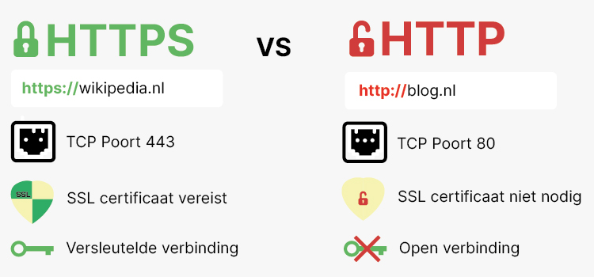

# HTTP & HTTPS Onderzoek (Pagina 2)

[⬅ Terug naar Pagina 1](pagina1.html)

## 5. Welke data zou gestolen kunnen worden via een onbeveiligde HTTP-verbinding?
Zonder beveiliging kunnen hackers de volgende gegevens onderscheppen:  
- **Persoonlijke gegevens:** Naam, adres, e-mail, geboortedatum  
- **Inloggegevens:** Gebruikersnamen en wachtwoorden  
- **Betaalgegevens:** Creditcard- en bankinformatie  
- **Cookies:** Toegang tot actieve sessies en accounts  

Met HTTPS worden deze gegevens versleuteld, waardoor ze onleesbaar zijn voor hackers.

[🔝 Terug naar Pagina 1](pagina1.html)

---

## 6. Wat is het doel van HTTPS en hoe verschilt het van HTTP?
Het doel van HTTPS is om de privacy en veiligheid van gebruikersgegevens te waarborgen tijdens communicatie.
Het belangrijkste verschil is dat HTTPS gegevens versleutelt en beschermt tegen onderschepping en manipulatie.

**Verschillen tussen HTTP en HTTPS:**
**Verschillen tussen HTTP en HTTPS:**

| Eigenschap         | HTTP                          | HTTPS                             |
|--------------------|-----------------------------|------------------------------------|
| Beveiliging        | Geen                         | SSL/TLS-versleuteling             |
| Gegevensoverdracht | Open, kan onderschept worden | Versleuteld en veilig             |
| Certificaat nodig  | Nee                          | Ja, SSL/TLS-certificaat vereist   |

[🔝 Terug naar Pagina 1](pagina1.html)

---

## 7. Hoe helpt HTTPS bij het waarborgen van privacy tijdens gegevensoverdracht?
HTTPS beschermt gebruikersgegevens door:  
1. **End-to-end encryptie:** Alleen de verzender en ontvanger kunnen de gegevens lezen.  
2. **Beveiligde verbinding:** Een SSL-certificaat bevestigt de identiteit van de website.  
3. **Data-integriteit:** Manipulatie van gegevens wordt gedetecteerd en voorkomen.

Meer lezen over HTTPS? Bekijk deze [externe pagina](https://www.ssl.com/article/what-is-https/).

[🔝 Terug naar Pagina 1](pagina1.html)

---

## 8. Bronvermelding
De volgende bronnen zijn gebruikt in dit onderzoek:

- SSL.com. (2024, 24 september). Wat is public-key cryptografie? Geraadpleegd op 17 februari 2025, van [https://www.ssl.com/article/what-is-public-key-cryptography/](https://www.ssl.com/article/what-is-public-key-cryptography/)

- Wikipedia. (2025, 16 februari). HTTPS. Geraadpleegd op 17 februari 2025, van [https://en.wikipedia.org/wiki/HTTPS](https://en.wikipedia.org/wiki/HTTPS)

- OWASP. (2023). OWASP API Security Project. Geraadpleegd op 17 februari 2025, van [https://owasp.org/www-project-api-security/](https://owasp.org/www-project-api-security/)

[🔝 Terug naar Pagina 1](pagina1.html)
